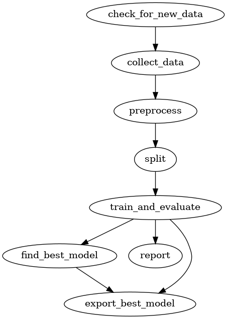
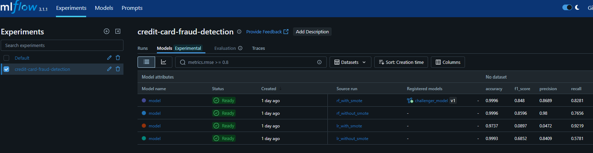
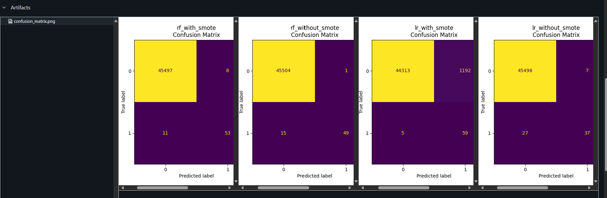
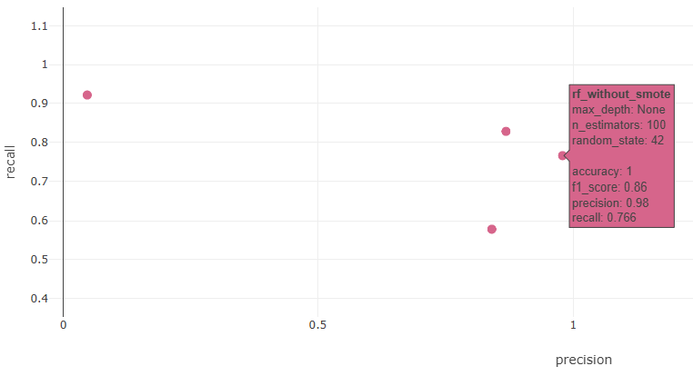

# 💳 Credit Card Fraud Detection – End-to-End MLOps Pipeline

[](https://github.com/elazkany/mlops-project/actions)


---

## 💡 Project Overview

This project demonstrates a complete Machine Learning Operations (MLOps) workflow for a credit card fraud detection system. Starting from exploratory data analysis in a Jupyter notebook, the pipeline scales up to a production-like workflow involving:

- Modularized data preprocessing & model training

- ETL and model evaluation pipelines with DVC

- Experiment tracking with MLflow (via CLI and UI)

- CI/CD automation using GitHub Actions

- Containerized API deployment with FastAPI + Docker

The model predicts whether a transaction is fraudulent and returns both the classification label and confidence score, served via a FastAPI endpoint.

---

## 🎯 Project Goals / Motivation

This project was designed to demonstrate a complete MLOps workflow — going beyond notebooks to build a production-like machine learning pipeline with modular code, reproducibility, and automation.

While the pipeline could easily be extended with hyperparameter tuning using libraries like Optuna or Hyperopt (and tracked via MLflow), the focus here is on **fast iteration and validation**. Instead of tuning, I compared two models — a baseline Logistic Regression and a Random Forest — both before and after applying resampling techniques to address class imbalance.

This approach allowed for quicker reproducibility and testing of the full pipeline, ensuring that all MLOps components work reliably across repeated runs.


## 🌟 Project Highlights

- **Notebook-to-Production Transition**  
  Started with exploratory data analysis and baseline modeling in Jupyter notebooks, then migrated to a fully modular and maintainable codebase.

- **Modular Code Structure**  
  Organized the project into logical, reusable components for data processing, modeling, deployment, and testing.

- **Data & Pipeline Versioning with DVC**  
  Used DVC to version datasets, intermediate files, and pipeline stages, ensuring reproducibility and traceability.

- **Experiment Tracking with MLflow**  
  Logged model parameters, metrics, artifacts, and comparisons programmatically and via the MLflow UI.

- **Model Comparison and Resampling Evaluation**  
  Compared baseline (Logistic Regression) and Random Forest models, with and without resampling, to evaluate the impact on class imbalance handling.

- **Best Model Promotion**  
  Automatically selected and promoted the best-performing model based on evaluation metrics for production using MLflow.

- **FastAPI Application for Real-Time Inference**  
  Served the trained model via a FastAPI endpoint that returns both the classification and confidence score.

- **Containerized Deployment with Docker**  
  Packaged the application into a Docker container to streamline deployment and ensure environment consistency.

- **CI/CD Automation with GitHub Actions**  
  Implemented a CI/CD pipeline that runs linting, unit tests, the full ML pipeline, Docker builds, and API deployment tests.

---

## 🗂️ Project Structure

The porject's structure is as follows


```
mlops-project/
├── Dockerfile                  # Docker image for the FastAPI app
├── LICENSE                     # Project license (MIT, etc.)
├── Makefile                    # Common CLI commands (e.g., test, lint, build)
├── README.md                   # You're here
├── app/                        # FastAPI app logic
│   └── app.py                  # Main API route for predictions
├── bin/                        # Utility shell scripts
│   └── setup.sh                # Environment setup scripts
├── data/                       # DVC-tracked data
│   ├── raw/                    # Original dataset
│   ├── processed/              # Cleaned and transformed data
│   ├── test/                   # Test datasets
│   ├── train/                  # Train datasets
│   ├── validation/             # Validation datasets
│   └── last_updated.txt        # Timestamp for data updates
├── deployment/                 # MLflow-promoted model artifacts
│   ├── model_artifacts/        # Saved models for deployment
│   └── model_version.json      # JSON with production model metadata
├── dvc.lock         
├── dvc.yaml                    # DVC pipeline specification
├── notebooks/                  # Jupyter notebooks for initial exploration
│   └── ml_baseline.ipynb       # EDA + baseline model exploration
├── params.yaml                 # Model and pipeline parameters
├── plots/                      # Visualizations (e.g., ROC curves) for CML reports
│   ├── predictions.csv
│   └── roc_curve.csv
├── project_structure.md        # Detailed project structure
├── reports/                    # Auto-generated metrics and visualizations
│   ├── best_model_metrics.json
│   ├── best_model_confusion_matrix.png
│   ├── compare_metrics.json
│   └── compare_confusion_matrices.png
├── requirements.txt            # Project dependencies
├── setup.cfg                   # Linting/config (e.g., flake8, pytest)
├── src/                        # Modular Python source code
│   ├── data/                   # Data ingestion & transformation
│   ├── deploy/                 # Functions to help serve models
│   ├── models/                 # Training and evaluation logic
│   ├── train/                  # Train & evaluate entry point
│   └── utils/                  # Shared helpers
├── tests/                      # Unit tests for CI
│   ├── data/
│   ├── deploy/
│   ├── models/
│   ├── train/
│   ├── utils/       

```
For a detailed diagram, see the [project structure](docs/project_structure.md)

---

## 🚀 Project Demo / Showcase

This section highlights key steps and outputs from the end-to-end MLOps pipeline.

### 🚦 **Pipeline Overview (DVC DAG)**

The entire machine learning workflow — from data download to model evaluation and promotion — is orchestrated and versioned using DVC.

**Pipeline Structure:**



<sub> *Generated using:*
```bash
dvc dag --dot > docs/ml_pipeline.dot
dot -Tpng docs/ml_pipeline.dot -o docs/ml_pipline.png
```
---

### 📊 **Experiment Tracking (MLflow UI)**

All model runs — including baseline and resampled versions — are tracked using MLflow.  
Both metrics and artifacts (such as confusion matrices) are logged automatically. 

**Metrics Overview:**

The image below shows a comparison of model metrics (e.g., precision, recall, F1-score) in the MLflow UI.



**Confusion Matrices:**

Each model's confusion matrix is logged as an artifact and visualized directly in MLflow.



**Model Comparison:**

Below is a scatter plot from MLflow UI comparing models based on **recall vs precision**, which helps guide the model selection process.



### 🤖 **CI/CD Automation (GitHub Actions)**

The CI/CD pipeline is managed via GitHub Actions.
The main workflow (`mlops-pipeline.yaml`) is triggered on every push to main and pull request. It performs the following main steps:

- Installs project dependencies

- Runs code linting and unit tests

- Executes the full DVC pipeline, including model training, evaluation, comparison, and promotion
- Builds and launches the Docker container for deployment
- Sends a test prediction request to the deployed FastAPI endpoint to validate the service

> 📌 Due to the length of CI logs and job lists, visual snapshots were omitted for clarity. The full workflow can be viewed in the GitHub Actions tab.

### 🛠️ **Tech Stack & Tools Used**

This project combines data science and MLOps tools to build a complete machine learning pipeline — from experimentation to deployment.

#### Data Science & Modeling
- **Python** — core programming language (version 3.10+)
- **scikit-learn** — for model development, training, and evaluation
- **imbalanced-learn** — for resampling techniques (SMOTE, under/oversampling)

#### MLOps & Pipeline Orchestration
- **DVC** — pipeline versioning and reproducibility
- **MLflow** — experiment tracking (UI + programmatic logging)
- **CML** — auto-generates model evaluation reports in CI/CD

#### Testing & Quality
- **pytest** — unit testing
- **flake8 / isort** — code linting and formatting

#### Deployment & Serving
- **FastAPI** — lightweight web server to serve model predictions
- **Docker** — containerized deployment of the inference API

#### CI/CD & Automation
- **GitHub Actions** — CI/CD workflows for pipeline runs, testing, and deployment validation

#### Project Setup
- **bin/setup.sh** — Shell script to setup the development environment
- **dvc.yaml** — defines the full ML pipeline stages (data ingestion, preprocessing, training, evaluation, model promotion).
- **Makefile** — command-line shortcuts for testing, linting, and running tasks
- **params.yaml** — centralized configuration for pipeline parameters
- **requirements.txt** — Python dependency management

### 📦 **Installation & Setup**

Follow the steps below to set up the environment and get started with the project.

#### 1. Clone the Repository

```bash
git clone https://github.com/elazkany/mlops-project.git
cd mlops-project
```

#### 2. Run the Environment Setup Script (Recommended)
Use the preconfigured setup script to install all dependencies and create the virtual environment automatically.

```bash
bash bin/setup.sh
```

This will:

- Install system dependencies (Python, pip, Docker)

- Create and activate a `.venv` virtual environment

- Install required Python packages from `requirements.txt`

- Add `.venv` to `.gitignore`

- Append the activation command to your `~/.bashrc`

> After running the script, restart your terminal to activate the environment automatically.

> This project was developed inside a DevContainer. Ensure Docker Desktop is running if you're using a containerized development environment.

#### 3. Configure DVC remote

This project uses a local DVC remote:

```bash
dvc remote add -d localstorage .dvc_cache
```

You can optionally configure a cloud-based remote (e.g., Google Drive, S3, Azure, SSH) to store and share data or model artifacts across environments.
Refer to the [DVC Remote Storage Documentation](https://dvc.org/doc/command-reference/remote/add) for detailed setup instructions.

#### 4. Run the DVC pipeline

Once the environment is set up, you can reproduce the full machine learning pipeline by running:

```bash
dvc repro
```

This will execute all pipeline stages defined in `dvc.yaml` — including data preprocessing, training, evaluation, model comparison, and promotion.

#### 5. Build and run th container


```bash
docker build -t fraud-api .
docker run -d -p 8000:8000 --name fraud-api fraud-api
```

#### 6. Test the API endpoint

Use the following curl command in a new terminal to test inference:

```bash
curl -X POST http://localhost:8000/predict \
            -H "Content-Type: application/json" \
            -d '{
              "Time": -0.5073720321, "V1": -16.5265065691, "V2": 8.5849717959, "V3": -18.6498531852,
              "V4": 9.5055935151, "V5": -13.7938185271, "V6": -2.8324042994, "V7": -16.701694296,
              "V8": 7.5173439037, "V9": -8.5070586368, "V10": -14.1101844415, "V11": 5.2992363496,
              "V12": -10.8340064815, "V13": 1.6711202533, "V14": -9.3738585836, "V15": 0.3608056416,
              "V16": -9.8992465408, "V17": -19.2362923698, "V18": -8.3985519949, "V19": 3.1017353689,
              "V20": -1.5149234353, "V21": 1.1907386948, "V22": -1.127670009, "V23": -2.3585787698,
              "V24": 0.673461329, "V25": -1.4136996746, "V26": -0.4627623614, "V27": -2.0185752488,
              "V28": -1.0428041697, "Amount": 4.7815272829
            }' | jq
```

Expected response:

```json
{
  "prediction_class": 1,
  "probability": 0.99
}
```

---
